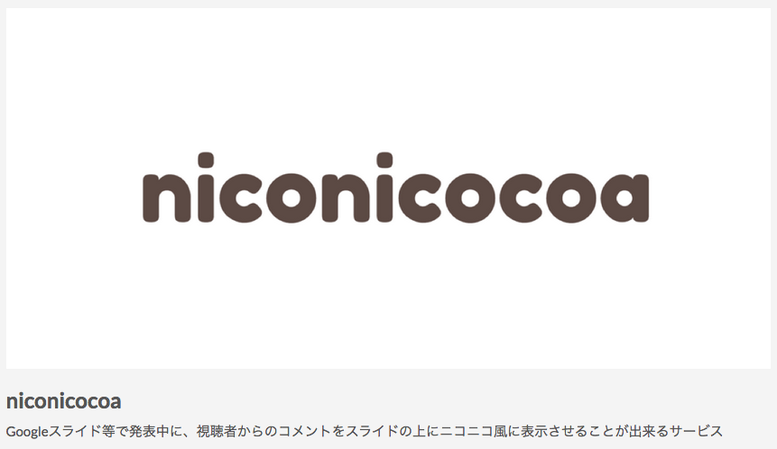
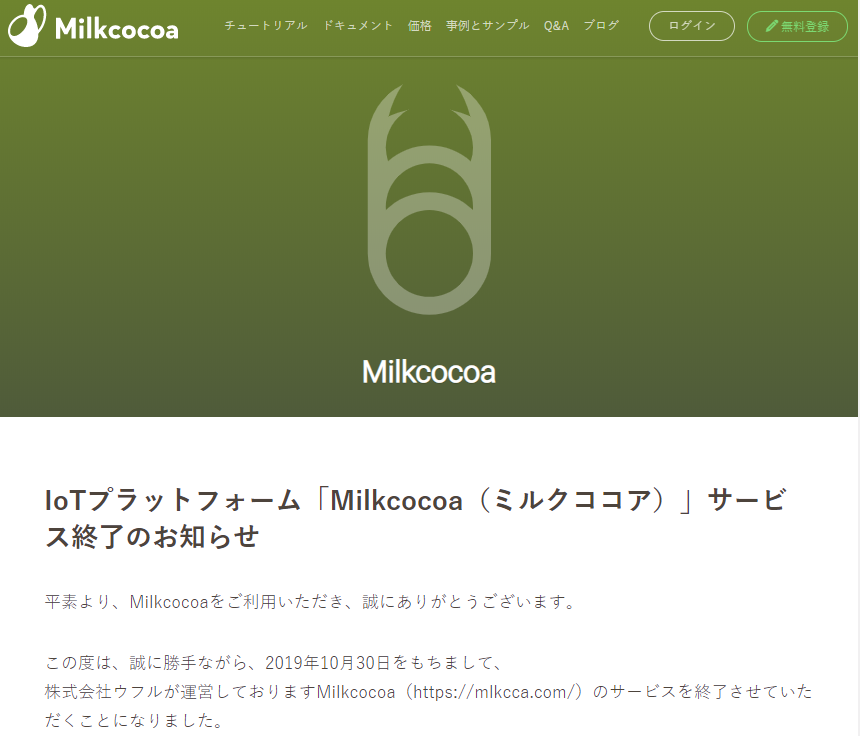
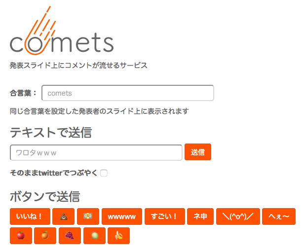

# commetter
commetterはniconicocoaをリファクタリングしてMQTT対応したElectron実装アプリです。

niconicocoaはブラウザ上のGoogleスライド等で、発表中に視聴者からのコメントをスライドの上にニコニコ風に表示させることが出来るサービスでした。

niconicocoaはバックエンドにMilkcocoaを使用しており、2019年10月30日にMilkcocoaが終了したため、利用できなくなりました。

niconicocoaは現在、バックエンドにFirebaseを使用した<a href="https://comets.nabettu.com/">comets</a>というサービス名に変わっています。
ブラウザのExtensionやPluginではなくブックマークレットを利用する方式は同様です。

commetterはMilkcocoaから汎用MQTTに対応(shiftr.ioで動作確認)し、ブックマークレット方式を止めてElectron実装アプリ(ブラウザ内に閉じず、ウィンドウ全体にコメントを表示)に変更しました。

commetter is MQTT and Electron implementation of niconicocoa, because Milkcocoa service was shutdown on 30 Oct, 2019.
